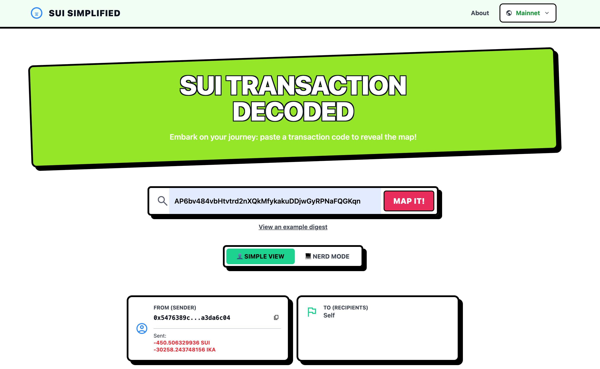
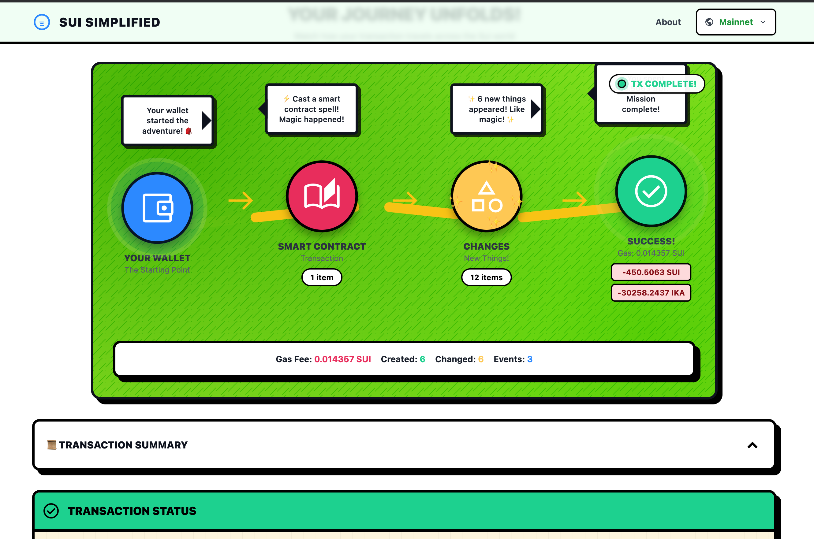
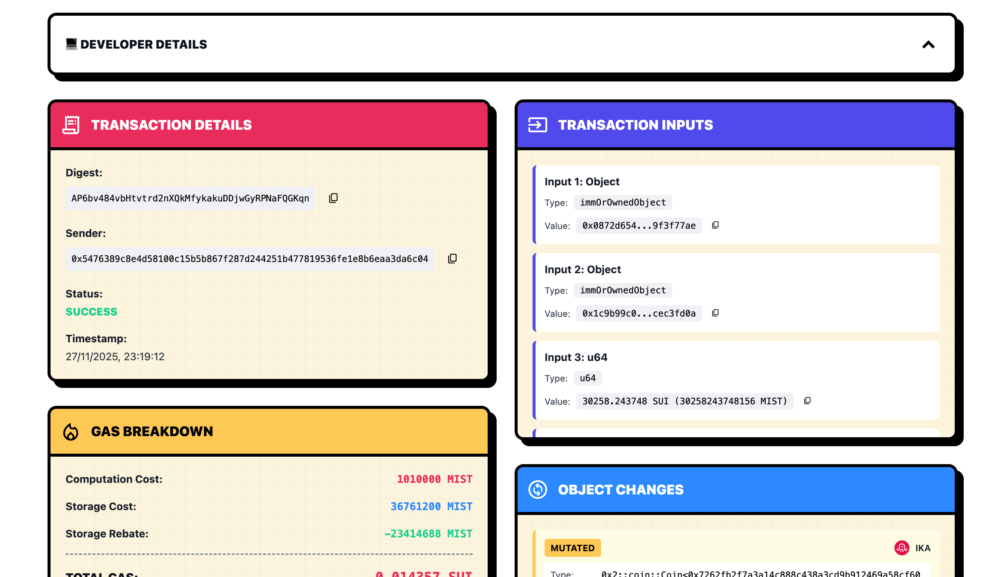

# Sui Simplified



A user-friendly web application that transforms complex Sui blockchain transactions into easy-to-understand visual explanations. Perfect for both beginners and developers who want to understand what happens in their Sui transactions.

## Features

- **Simple View**: Easy-to-understand transaction summaries for beginners
- **Developer View**: Detailed technical information for debugging and analysis
- **Visual Journey Map**: Interactive flow showing transaction progression
- **Multi-Network Support**: Switch between Mainnet, Testnet, and Devnet
- **Real-time Data**: Direct integration with Sui blockchain RPC endpoints
- **Token Logos**: Visual representation of tokens with CoinGecko integration




##  Architecture

### Tech Stack

- **Frontend Framework**: React 19 with TypeScript
- **Build Tool**: Vite 7
- **Styling**: Tailwind CSS 3 with custom comic-style theme
- **Routing**: React Router DOM 7
- **Blockchain SDK**: @mysten/sui 1.45.0

### Project Structure

```
src/
├── components/          # React components
│   ├── Header.tsx      # Navigation with network selector
│   ├── Footer.tsx      # Footer with links
│   ├── HeroSection.tsx # Hero banner
│   ├── TransactionSearch.tsx # Search input
│   ├── JourneyMap.tsx  # Visual transaction flow
│   ├── SecretLoreCodex.tsx # Detailed transaction view
│   └── Tooltip.tsx     # Custom tooltip component
│
├── pages/              # Page components
│   ├── Home.tsx        # Main transaction explorer
│   ├── About.tsx       # About page
│   ├── PrivacyPolicy.tsx
│   └── TermsOfService.tsx
│
├── services/           # External service integrations
│   ├── suiService.ts   # Sui blockchain RPC client
│   └── coingeckoService.ts # CoinGecko API for token logos
│
├── utils/              # Utility functions
│   ├── transactionParser.ts # Parse raw Sui transaction data
│   ├── journeyData.ts  # Extract journey map data
│   └── tokenLogos.ts   # Token logo utilities
│
├── hooks/              # Custom React hooks
│   ├── useDarkMode.tsx
│   ├── useTokenLogo.tsx
│   └── useCopyFeedback.tsx
│
└── types/              # TypeScript type definitions
    └── transaction.ts  # Transaction data types
```

### Component Architecture

**Data Flow:**
```
User Input (Transaction Digest)
    ↓
TransactionSearch → suiService.getTransaction()
    ↓
Raw Sui Transaction Data
    ↓
TransactionParser.parseDetailed()
    ↓
SimplifiedTransaction / DetailedTransaction
    ↓
JourneyMap + SecretLoreCodex (Display)
```

**Key Components:**

1. **TransactionParser**: Transforms raw Sui JSON RPC responses into user-friendly formats
   - `parseSimplified()`: Creates simplified view for beginners
   - `parseDetailed()`: Creates detailed view for developers
   - Handles balance changes, object changes, events, operations

2. **JourneyDataExtractor**: Generates stage data for the visual journey map
   - Extracts transaction stages (Wallet → Action → Changes → Result)
   - Creates child-friendly descriptions
   - Categorizes transactions (DeFi, NFT, Transfer, Contract)

3. **SuiService**: Manages blockchain connections
   - Handles network switching (Mainnet/Testnet/Devnet)
   - Fetches transaction data via Sui JSON RPC
   - Error handling and retry logic

4. **CoinGeckoService**: Token logo management
   - Fetches logos from CoinGecko API
   - Implements caching (in-memory + localStorage)
   - 1-hour cache duration

## Data Sources

### Primary Data Source: Sui Blockchain

**RPC Endpoints:**
- **Mainnet**: `https://fullnode.mainnet.sui.io:443`
- **Testnet**: `https://fullnode.testnet.sui.io:443`
- **Devnet**: `https://fullnode.devnet.sui.io:443`

**Data Retrieved:**
- Transaction details (digest, sender, timestamp)
- Transaction inputs and parameters
- Smart contract calls (package, module, function)
- Object changes (created, mutated, deleted)
- Balance changes (coin types, amounts)
- Events emitted
- Gas usage (computation, storage, rebate)
- Transaction effects and status

**API Method:**
```typescript
client.getTransactionBlock({
  digest: string,
  options: {
    showInput: true,
    showEffects: true,
    showEvents: true,
    showObjectChanges: true,
    showBalanceChanges: true,
    showRawInput: true,
  }
})
```

## Usage

### For End Users

1. **Navigate to the application**
2. **Select Network**: Choose Mainnet, Testnet, or Devnet from the header dropdown
3. **Enter Transaction Digest**: Paste a Sui transaction hash in the search field
4. **Choose View Mode**:
   - **Simple View**: Quick overview with balance changes and status
   - **Developer View**: Detailed technical information for debugging
5. **Explore the Journey Map**: Visual flow showing transaction progression
6. **Review Details**: Expand sections to see full transaction data

### Styling

The application uses Tailwind CSS with a custom comic-style theme defined in:
- `tailwind.config.js`: Theme configuration
- `src/index.css`: Custom utilities and animations

## 📦 Dependencies

**Core:**
- `react`: UI framework
- `react-dom`: React DOM bindings
- `react-router-dom`: Client-side routing
- `@mysten/sui`: Sui blockchain SDK

**Development:**
- `vite`: Build tool and dev server
- `typescript`: Type safety
- `tailwindcss`: Utility-first CSS
- `eslint`: Code linting

## 🔐 Privacy & Security

- **No Server-Side Storage**: All processing happens client-side
- **Local Storage Only**: Used for preferences and logo caching
- **No Private Keys**: Application only reads public blockchain data
- **Direct RPC Calls**: No intermediate servers or data collection

## 🤝 Contributing

Contributions are welcome! Please feel free to submit issues or pull requests.

---

**Built with ❤️ for the Sui community**
